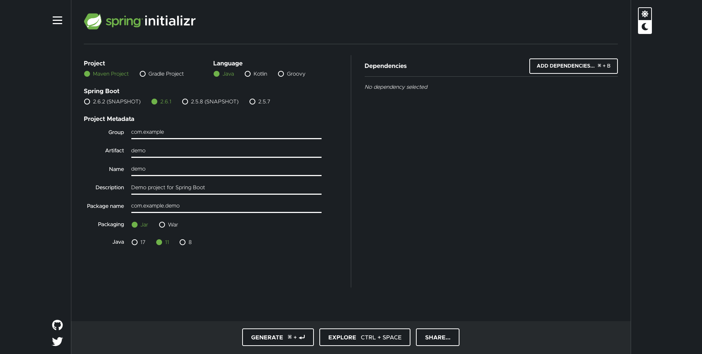

## 스프링 부트 소개
- https://docs.spring.io/spring-boot/docs/current/reference/htmlsingle/#getting-started-introducing-spring-boot
    * Provide a radically faster and widely accessible getting-started experience for all Spring development.
    * Be opinionated out of the box but get out of the way quickly as requirements start to diverge from the defaults.
    * Provide a range of non-functional features that are common to large classes of projects (such as embedded servers, security, metrics, health checks, and externalized configuration).
    * Absolutely no code generation and no requirement for XML configuration.

## 스프링 부트 시작하기
- https://docs.spring.io/spring-boot/docs/current/reference/htmlsingle/#getting-started-maven-installation
  - 메이븐 pom.xml에 parent, dependency, plugin 설정.
    ```xml
    <?xml version="1.0" encoding="UTF-8"?>
    <project xmlns="http://maven.apache.org/POM/4.0.0"
             xmlns:xsi="http://www.w3.org/2001/XMLSchema-instance"
             xsi:schemaLocation="http://maven.apache.org/POM/4.0.0 http://maven.apache.org/xsd/maven-4.0.0.xsd">
        <modelVersion>4.0.0</modelVersion>
  
        <groupId>me.sungbin</groupId>
        <artifactId>springboot-getting-started</artifactId>
        <version>1.0-SNAPSHOT</version>
  
        <properties>
            <maven.compiler.source>17</maven.compiler.source>
            <maven.compiler.target>17</maven.compiler.target>
        </properties>
  
        <parent>
            <groupId>org.springframework.boot</groupId>
            <artifactId>spring-boot-starter-parent</artifactId>
            <version>2.6.1</version>
        </parent>
  
        <dependencies>
            <dependency>
                <groupId>org.springframework.boot</groupId>
                <artifactId>spring-boot-starter-web</artifactId>
            </dependency>
        </dependencies>
  
        <build>
            <plugins>
                <plugin>
                    <groupId>org.springframework.boot</groupId>
                    <artifactId>spring-boot-maven-plugin</artifactId>
                </plugin>
            </plugins>
        </build>
    </project>
    ```
## 스프링 부트 프로젝트 생성기
- https://start.spring.io/




## 스프링 부트 프로젝트 구조
- https://docs.spring.io/spring-boot/docs/current/reference/htmlsingle/#using-boot-structuring-your-code
- 메이븐 기본 프로젝트 구조와 동일
  * 소스 코드 (src\main\java)
  * 소스 리소스 (src\main\resource)
  * 테스트 코드 (src\test\java)
  * 테스트 리소스 (src\test\resource)
- 메인 애플리케이션 위치 
  * 기본 패키지

## 자동 설정 이해
- @EnableAutoConfiguration (@SpringBootApplication 안에 숨어 있음)
- 빈은 사실 두 단계로 나눠서 읽힘
  * 1단계: @ComponentScan
  * 2단계: @EnableAutoConfiguration
- @ComponentScan
  * @Component
  * @Configuration @Repository @Service @Controller @RestController
- @EnableAutoConfiguration
  * spring.factories
    * org.springframework.boot.autoconfigure.EnableAutoConfiguration
  * @Configuration
  * @ConditionalOnXxxYyyZzz

## 자동 설정 만들기 : Starter와 AutoConfiguration
- https://docs.spring.io/spring-boot/docs/current/reference/htmlsingle/#boot-features-developing-auto-configuration
- Xxx-Spring-Boot-Autoconfigure 모듈: 자동 설정
- Xxx-Spring-Boot-Starter 모듈: 필요한 의존성 정의
- 그냥 하나로 만들고 싶을 때는?
  * Xxx-Spring-Boot-Starter
- 구현 방법
  * 의존성 추가
  
  ```xml
  <dependencies>
     <dependency>
         <groupId>org.springframework.boot</groupId>
         <artifactId>spring-boot-autoconfigure</artifactId>
     </dependency>
     <dependency>
         <groupId>org.springframework.boot</groupId>
         <artifactId>spring-boot-autoconfigure-processor</artifactId>
         <optional>true</optional>
     </dependency>
  </dependencies>
  
  <dependencyManagement>
     <dependencies>
         <dependency>
             <groupId>org.springframework.boot</groupId>
             <artifactId>spring-boot-dependencies</artifactId>
             <version>2.0.3.RELEASE</version>
             <type>pom</type>
             <scope>import</scope>
         </dependency>
     </dependencies>
  </dependencyManagement>
  ```

  * @Configuration 파일 작성
  * src/main/resource/META-INF에 spring.factories 파일 만들기
  * spring.factories 안에 자동 설정 파일 추가

  ```factories
  org.springframework.boot.autoconfigure.EnableAutoConfiguration=\
    me.sungbin.HolomanConfiguration
  ```
  
  * mvn install

## 자동 설정 만들기 2부: @ConfigurationProperties
- 덮어쓰기 방지하기
  * @ConditionalOnMissingBean
- 빈 재정의 수고 덜기
  * @ConfigurationProperties(“holoman”)
  * @EnableConfigurationProperties(HolomanProperties)
  * 프로퍼티 키값 자동 완성

```xml
<dependency>
   <groupId>org.springframework.boot</groupId>
   <artifactId>spring-boot-configuration-processor</artifactId>
   <optional>true</optional>
</dependency>
```

## 내장 웹 서버 이해
- 스프링 부트는 서버가 아니다.
  * 톰캣 객체 생성
  * 포트 설정
  * 톰캣에 컨텍스트 추가
  * 서블릿 만들기
  * 톰캣에 서블릿 추가
  * 컨텍스트에 서블릿 맵핑
  * 톰캣 실행 및 대기
- 이 모든 과정을 보다 상세히 또 유연하고 설정하고 실행해주는게 바로 스프링 부트의 자동 설정.
  * ServletWebServerFactoryAutoConfiguration (서블릿 웹 서버 생성)
    * TomcatServletWebServerFactoryCustomizer (서버 커스터마이징)
  * DispatcherServletAutoConfiguration
    * 서블릿 만들고 등록